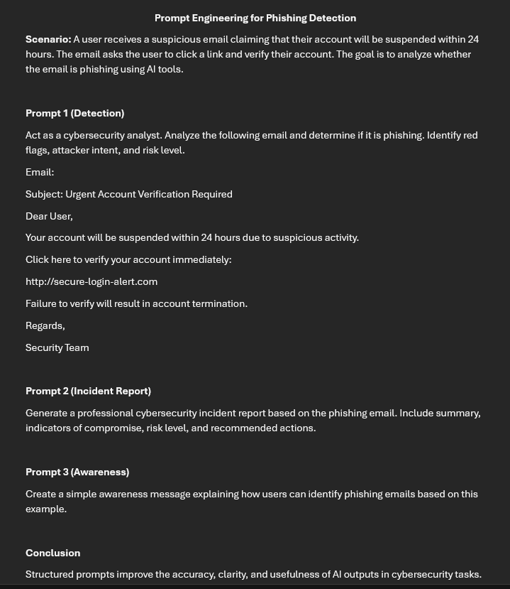
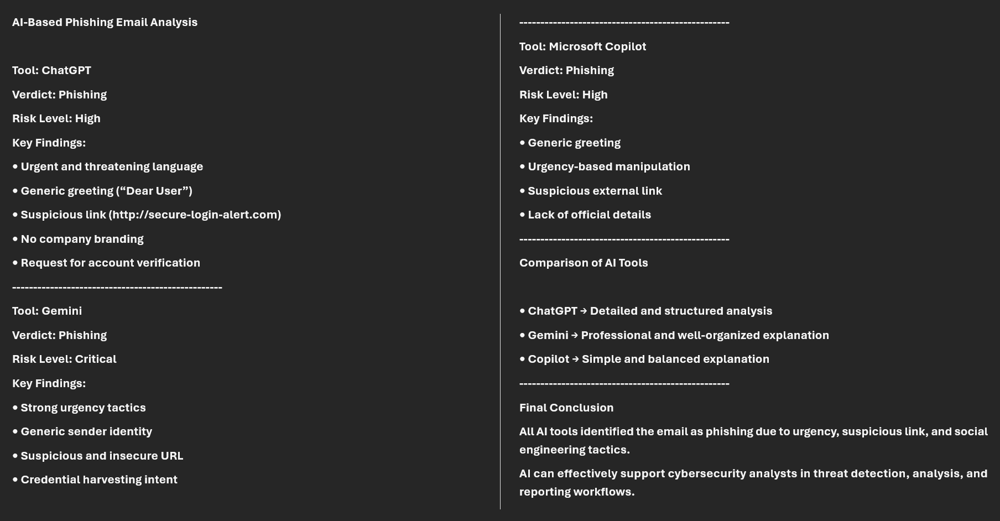
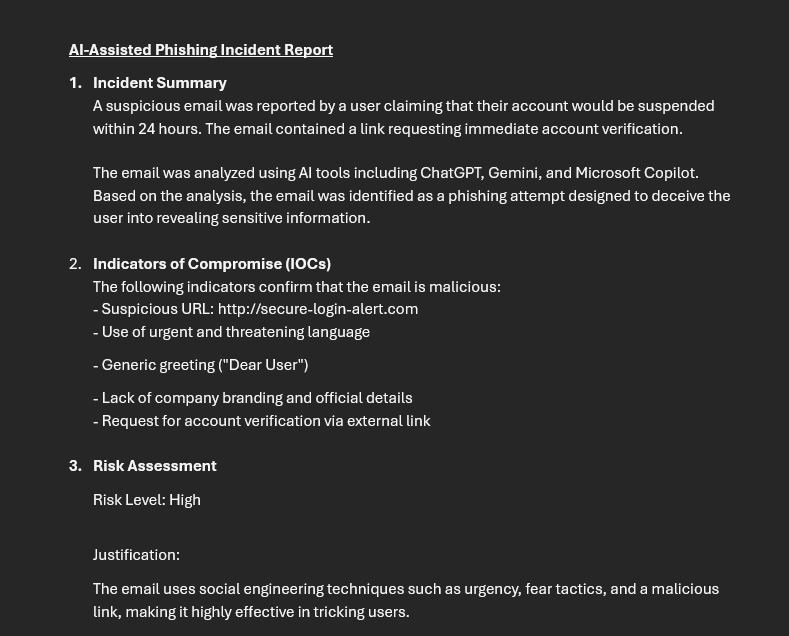
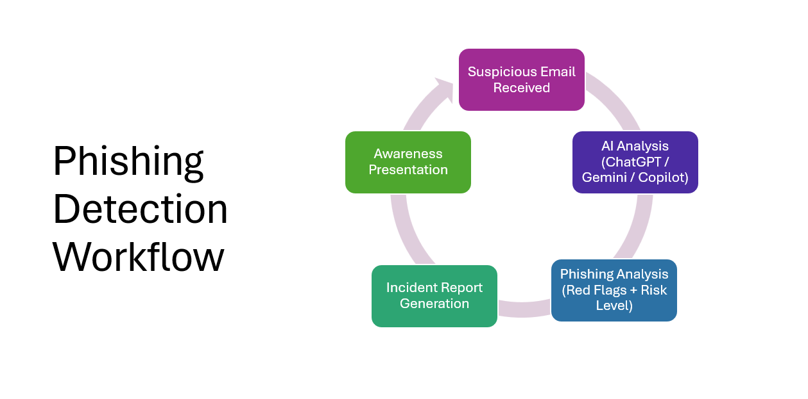
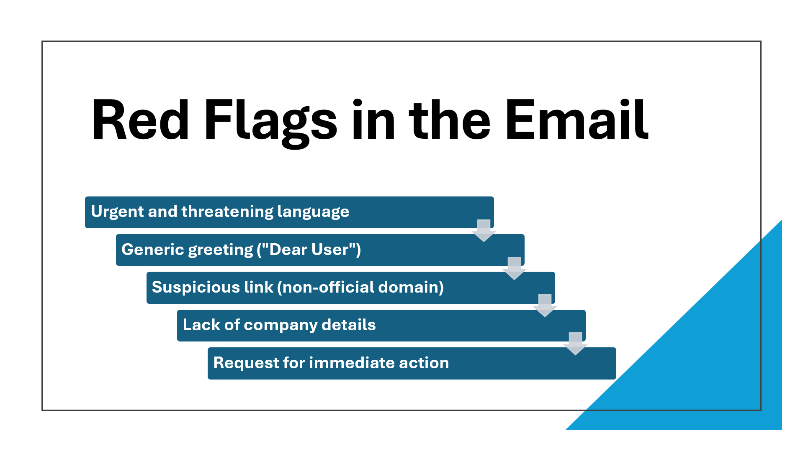

# AI-Driven SOC Assistant for Phishing Detection

## 📌 Project Overview
This project simulates a real-world SOC (Security Operations Center) workflow using AI tools to analyze phishing emails, identify threats, and generate incident reports.

## 🧠 Tools Used
- ChatGPT
- Gemini
- Microsoft Copilot
- Claude

## ⚙️ Workflow
Suspicious Email → AI Analysis → Phishing Detection → Incident Report → Awareness Presentation

## 🚨 Scenario
A user receives a suspicious email claiming account suspension and requesting immediate verification.

## 🔍 Key Features
- AI-based phishing detection
- Prompt engineering
- Multi-tool analysis comparison
- Risk classification
- Incident reporting
- Awareness presentation

## 📸 Screenshots

**Prompt Engineering**

**AI Analysis**

**Incident Report**

**Workflow**

**Awareness**

## 🎯 Conclusion
This project demonstrates how AI tools can assist cybersecurity analysts in detecting phishing emails, analyzing threats, and improving security workflows.
