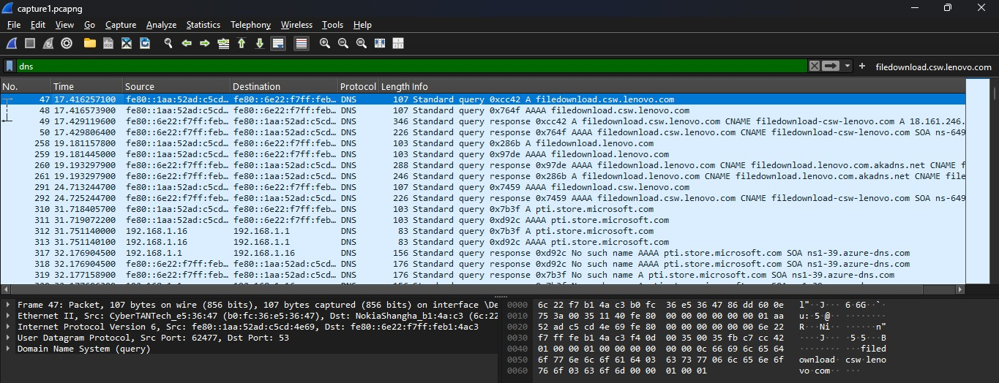
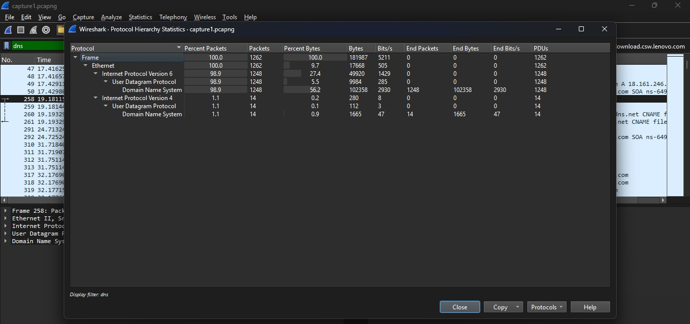
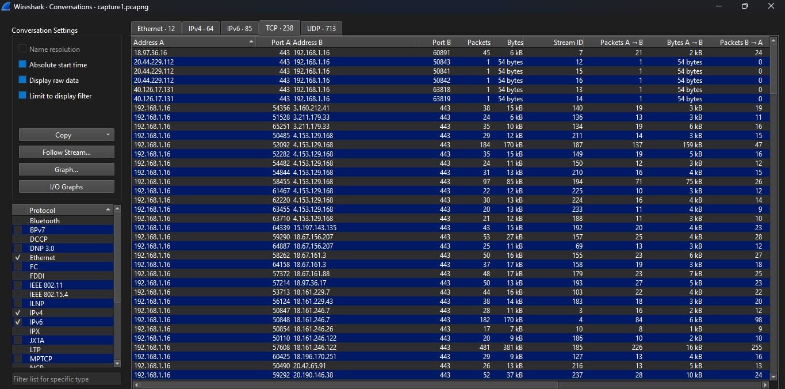
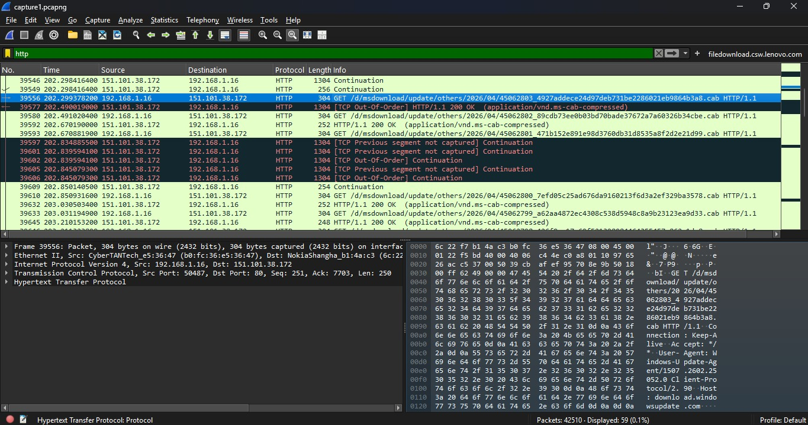
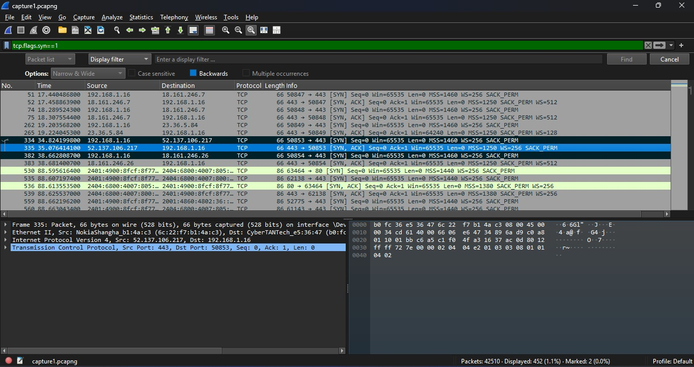

# 🔬 Network Traffic Analysis using Wireshark

## 🚀 Project Overview

A comprehensive network traffic analysis project using Wireshark to capture, filter, and inspect real packet-level data — covering DNS resolution, TCP/IP conversation mapping, HTTP traffic inspection, and TCP SYN-based connection pattern analysis.

**Demonstrates core SOC Analyst skills**: packet capture analysis, display filter usage, protocol hierarchy reading, suspicious traffic identification, and network behaviour baselining.

| What | Detail |
|------|--------|
| Tool | Wireshark (Packet Analyser) |
| Capture file | capture1.pcapng |
| Total packets captured | 42,510 packets |
| Protocols analysed | DNS, TCP, HTTP, UDP, IPv4, IPv6 |
| Analysis techniques | Filtering, Protocol Hierarchy, Conversations, Stream following |
| MITRE mapping | T1040 — Network Sniffing, T1046 — Network Service Discovery |

## 🛠️ Tools & Filters Used

- **Wireshark** — packet capture and analysis tool
- **Display filters**: `dns`, `http`, `tcp.flags.syn==1`
- **Statistics tools**: Protocol Hierarchy, TCP Conversations
- **Capture file format**: .pcapng (Wireshark native format)

## 🔍 Analysis Breakdown

### 1. DNS Traffic Analysis
**Filter used:** `dns`

Isolated all DNS query and response traffic to identify which domains the host was communicating with. Key domains identified:
- `filedownload.csw.lenovo.com` — Lenovo firmware/update traffic
- `pti.store.microsoft.com` — Microsoft store traffic
- CNAME resolution chains visible, confirming legitimate DNS behaviour

*DNS filter applied — showing standard query and response pairs with domain resolution details*

---

### 2. Protocol Hierarchy Statistics
**Tool:** Statistics → Protocol Hierarchy

Analysed the full protocol composition of the capture to understand traffic baseline:
- **98.9% UDP** — dominated by DNS traffic (1,248 packets, 102,358 bytes)
- **1.1% IPv4** — standard web traffic (14 DNS packets)
- Total capture: 1,262 packets, 181,987 bytes at 5,211 bits/second

*Protocol hierarchy showing traffic distribution — 98.9% DNS/UDP confirms this is a DNS-heavy capture*

---

### 3. TCP Conversations Mapping
**Tool:** Statistics → Conversations → TCP tab

Mapped all active TCP connections in the capture:
- **238 unique TCP streams** identified
- Multiple connections to **port 443 (HTTPS)** — encrypted web traffic
- Primary host `192.168.1.16` communicating with multiple external IPs
- Largest stream: 481 packets, 381 kB (sustained data transfer)

*TCP conversations view — 238 streams mapped showing bidirectional traffic between local host and external servers*

---

### 4. HTTP Traffic Inspection
**Filter used:** `http`

Inspected unencrypted HTTP traffic to identify application-layer activity:
- **GET requests** to Microsoft update servers (151.101.38.172)
- **200 OK responses** confirming successful downloads
- Windows Update cab files being downloaded: `/msdownload/update/others/2026/`
- TCP out-of-order segments visible — normal for large file transfers

*HTTP filter showing GET requests and 200 OK responses — Windows Update traffic downloading .cab update files*

---

### 5. TCP SYN Packet Analysis
**Filter used:** `tcp.flags.syn==1`

Filtered for TCP SYN packets to map all connection initiation attempts:
- **452 SYN packets** displayed out of 42,510 total (1.1% of capture)
- Connections initiated to port **443** (HTTPS) — normal encrypted traffic
- **IPv6 connections** also visible (2401:4900 address range)
- SYN/ACK responses confirmed — no unanswered SYNs (no port scanning detected)

*TCP SYN filter (tcp.flags.syn==1) — 452 connection initiations displayed, showing normal handshake patterns*

---

## 📊 Results & Outcomes

| Metric | Result |
|--------|--------|
| Total packets captured | 42,510 packets |
| Packets analysed (filtered) | 1,262 DNS + 452 SYN + HTTP traffic |
| Protocols identified | DNS, TCP, HTTP, UDP, IPv4, IPv6 |
| DNS domains resolved | filedownload.csw.lenovo.com, pti.store.microsoft.com |
| TCP streams mapped | 238 unique conversations |
| Suspicious activity detected | No malicious traffic — baseline normal behaviour confirmed |
| Port scan indicators | None — all SYN packets received ACK responses |

**Key finding:** The captured traffic represents normal host behaviour — legitimate DNS resolution, HTTPS connections to known Microsoft and Lenovo servers, and standard Windows Update activity. No indicators of port scanning, data exfiltration, or malicious DNS queries were identified. This establishes a clean **network traffic baseline** — a critical SOC skill for anomaly detection.

## 🎯 MITRE ATT&CK Coverage

| Tactic | Technique | ID | Relevance to this project |
|--------|-----------|-----|--------------------------|
| Discovery | Network Sniffing | T1040 | Core skill used — packet capture and analysis |
| Discovery | Network Service Discovery | T1046 | TCP SYN analysis identifies active services/ports |
| Command & Control | Application Layer Protocol | T1071 | DNS and HTTP traffic analysis techniques |

## 💡 What I Learned

**Display filters are the core SOC skill in Wireshark.**
The difference between `dns`, `http`, and `tcp.flags.syn==1` filters is the difference between seeing everything and seeing exactly what matters. In a real incident, the ability to quickly isolate relevant traffic from thousands of packets is critical.

**Protocol Hierarchy Statistics reveals the traffic fingerprint.**
98.9% DNS/UDP traffic immediately tells you this is a DNS-heavy environment. In a real SOC, a sudden shift in this ratio — say, a spike in ICMP or unusual UDP ports — is an immediate anomaly flag worth investigating.

**Baseline normal before you hunt for abnormal.**
This analysis confirmed clean, legitimate traffic. In real SOC work, you need to know what normal looks like for your environment before you can detect what is abnormal. This project practised exactly that — establishing a traffic baseline.

**What I would add in a real SOC environment:**
- Use `tcp.flags.syn==1 && !tcp.flags.ack==1` to isolate unanswered SYN packets — the port scanning signature
- Set Wireshark alerts for DNS queries to newly registered domains
- Export suspicious packets to a threat intel feed for IOC correlation
- Feed pcap data into Splunk for automated detection (combines with my Splunk Brute Force project)

## 📁 Project Files

| File | Description |
|------|-------------|
| [1.jpeg](1.jpeg) | DNS traffic filter — query and response analysis |
| [2.jpeg](2.jpeg) | Protocol Hierarchy Statistics — traffic composition |
| [3.jpeg](3.jpeg) | TCP Conversations — 238 streams mapped |
| [4.jpeg](4.jpeg) | HTTP traffic inspection — Windows Update GET requests |
| [5.jpeg](5.jpeg) | TCP SYN analysis — connection initiation patterns |
| [Network_Traffic_Analysis_Report_MSVK_Maneesh.docx](Network_Traffic_Analysis_Report_MSVK_Maneesh.docx) | Full written analysis report |

## 🏷️ Skills Demonstrated

`Wireshark` `Packet Capture Analysis` `Display Filters` `DNS Analysis` `TCP/IP` `HTTP Inspection` `Protocol Hierarchy` `Network Baselining` `TCP SYN Analysis` `MITRE ATT&CK` `Network Security Monitoring`

## 🔗 Related Projects

- [Splunk Brute Force Detection](../Splunk-Brute-Force-Detection) — SIEM-based attack detection using SPL queries
- [AI-SOC Phishing Detection](../AI-SOC-Phishing-Detection) — AI-assisted phishing analysis and incident reporting
