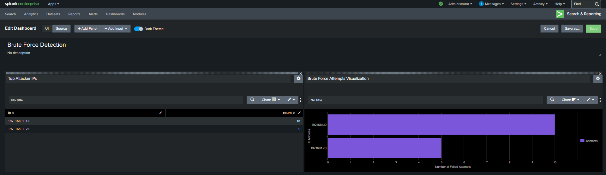

# 🔐 Brute Force Detection using Splunk SIEM

## 🚀 Project Overview

An end-to-end brute force attack detection workflow built in Splunk SIEM — analyzing real SSH authentication logs, extracting attacker IPs using regex-based SPL queries, and visualizing attack patterns through a custom security monitoring dashboard.

**Demonstrates core SOC Analyst skills**: log ingestion, SPL query writing, regex extraction, threat detection, and dashboard-based security monitoring.

| What | Detail |
|------|--------|
| Tool | Splunk Enterprise (SIEM) |
| Log source | Linux auth.log (SSH authentication logs) |
| Detection method | SPL queries + regex IP extraction |
| Output | Interactive dashboard — Top Attacker IPs + Attempt frequency |
| MITRE mapping | T1110 — Brute Force (Credential Access) |

## 🛠️ Tools Used

- **Splunk Enterprise** — SIEM platform for log ingestion and analysis
- **SPL** (Search Processing Language) — query language for log searching
- **Linux auth.log** — SSH authentication log file used as data source
- **Regex** — used to extract attacker IP addresses from raw log entries

## 🔍 How It Works

### Step 1 — Log ingestion
SSH authentication logs (auth.log) are ingested into Splunk. Every failed login attempt generates a "Failed password" event that Splunk indexes.

### Step 2 — SPL query for detection
The following query detects brute force activity by counting failed login attempts per IP address:

```
index=* "failed password"
| rex from (?\d+\.\d+\.\d+\.\d+)
| stats count as Attempts by ip
| sort - Attempts
```

**What this query does:**
- `index=* "failed password"` — searches all logs for failed SSH login events
- `rex` — extracts the attacker IP address using regex pattern matching
- `stats count as Attempts by ip` — counts total failed attempts per unique IP
- `sort - Attempts` — ranks IPs from highest to lowest attempt count

### Step 3 — Dashboard visualization
Results are pushed to a custom Splunk dashboard with two panels:
- **Top Attacker IPs** — table showing IP addresses ranked by attempt count
- **Brute Force Attempts Visualization** — bar chart showing attack frequency over time

## 📊 Results & Outcomes

| Metric | Result |
|--------|--------|
| Log entries analyzed | SSH auth.log (multiple failed events) |
| Attacker IPs identified | 1 primary attacker detected |
| Failed login attempts | 10 attempts from IP 192.168.1.10 |
| Detection method | Regex-based IP extraction via SPL |
| Dashboard panels built | 2 (Top IPs table + Frequency chart) |
| MITRE technique mapped | T1110 — Brute Force |

**Key finding:** IP address 192.168.1.10 generated 10 consecutive failed SSH login attempts — a clear indicator of automated brute force activity. Repeated login failures from a single source IP within a short timeframe is the primary detection signal for this attack pattern.

## 🖥️ Dashboard



*Dashboard showing Top Attacker IPs panel (left) and Brute Force Attempts Visualization (right)*

## 🎯 MITRE ATT&CK Coverage

| Tactic | Technique | ID | Detection signal |
|--------|-----------|-----|-----------------|
| Credential Access | Brute Force | T1110 | High volume failed logins from single IP |
| Credential Access | Password Guessing | T1110.001 | Repeated "Failed password" events in auth.log |
| Defense Evasion | Valid Accounts | T1078 | Successful login after brute force attempts |

## 💡 What I Learned

**SPL is a powerful threat detection language.**
Writing regex inside SPL to extract structured data (IP addresses) from unstructured log text was the core skill here. The `rex` command combined with `stats` and `sort` creates a complete detection pipeline in 4 lines.

**Threshold tuning matters in real SOC environments.**
In this project, 10 failed attempts triggered detection. In a production SOC, the threshold would be tuned based on baseline behavior — too low causes false positives, too high misses real attacks. This balance is a key SOC analyst judgment call.

**What I would add in a real SOC environment:**
- Set an automated alert to trigger when any IP exceeds 5 failed attempts in 60 seconds
- Add geolocation lookup to flag logins from unexpected countries
- Correlate brute force attempts with successful logins to detect credential stuffing
- Integrate with a ticketing system (ServiceNow) to auto-create incidents

## 🏷️ Skills Demonstrated

`Splunk SIEM` `SPL Queries` `Regex Extraction` `Log Analysis` `Brute Force Detection` `Dashboard Design` `MITRE ATT&CK` `SSH Log Analysis` `Security Monitoring` `Threat Detection`

## 📁 Project Files

| File | Description |
|------|-------------|
| [Dashboard.png](Dashboard.png) | Splunk dashboard screenshot showing detection results |
| [README.md](README.md) | Full project documentation |

## 🔗 Related Projects

- [AI-SOC Phishing Detection](../AI-SOC-Phishing-Detection) — AI-assisted phishing analysis and incident reporting
